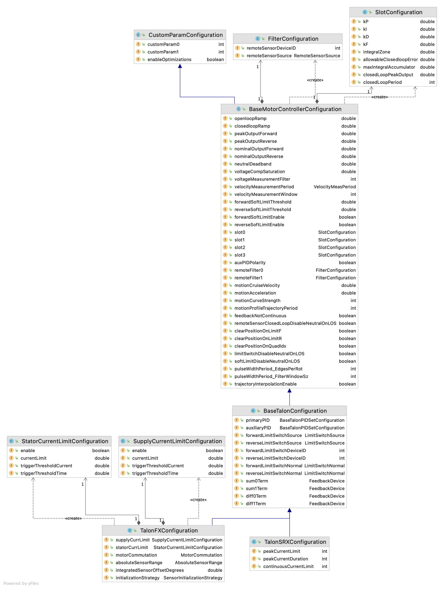

# CTRE Configs Checker

Help keep track of CTRE device configuration classes from season to season.

## Instructions

1. Update `vendordeps/Phoenix.json` to the version you want to check against.
2. Run unit tests with `gradlew test`.
3. Tests will fail if any fields are added to configuration classes or if the default values have changed.

## Classes Checked

These checks are up to date with the Phoenix 5.19.4 API.

